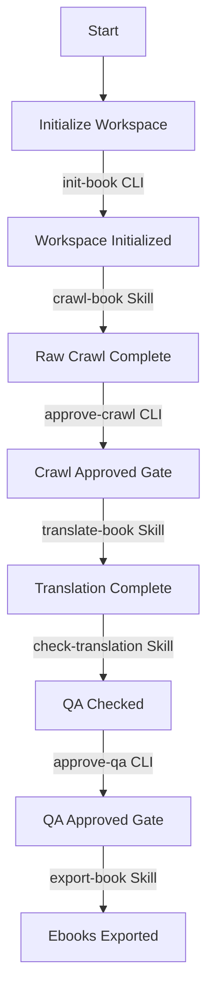

# Dich Truyen Agent - Agent Orchestration Guide

This document defines the agent-native orchestration workflow for translating Chinese novels into Vietnamese. It acts as the high-level playbook for Antigravity agents to coordinate the crawl, translation, quality assurance, and export pipeline.

## 1. Workspace Lifecycle & Gates

The novel workspace evolves through a series of deterministic gates. Downstream phases are strictly blocked until preceding gates are satisfied.



Each gate is verified using the CLI helper:
```powershell
uv run python main.py check-gate --workspace books/<book-slug> --type <crawl-approved|qa-approved>
```

---

## 2. Pipeline Skills & Entry Points

Antigravity agents must run the following skills and commands to transition the workspace through each phase. **Refer to each skill's `SKILL.md` for specific step-by-step instructions.**

### Phase 1: Setup & Initialization
* **Responsibility**: Initialize a clean book directory and build Pydantic schemas.
* **Retrieve Metadata**: To prevent request blocking/security issues on target sites, explicitly fetch the page content via the terminal using a Python script with custom browser-like headers and the appropriate site encoding (e.g., `gbk` or `utf-8`) instead of built-in URL fetch tools:
  ```powershell
  $env:PYTHONUTF8=1
  uv run python -c "import httpx; from bs4 import BeautifulSoup; r = httpx.get('<source-url>', headers={'User-Agent': 'Mozilla/5.0 (Windows NT 10.0; Win64; x64) AppleWebKit/537.36 (KHTML, like Gecko) Chrome/120.0.0.0 Safari/537.36'}, follow_redirects=True, timeout=15); html = r.content.decode('gbk', errors='ignore'); soup = BeautifulSoup(html, 'lxml'); print('Title:', soup.title.string.strip() if soup.title else None); print('H1:', soup.find('h1').text.strip() if soup.find('h1') else None); import re; author = re.search(r'\u4f5c\u8005\uff1a([^\r\n\xa0\u3000]+)', soup.get_text()); print('Author:', author.group(1).strip() if author else None)"
  ```
* **Entry Point**: Run the CLI setup:
  ```powershell
  uv run python main.py init-book --slug <book-slug> --title "<title>" --source-url "<source-url>" [--author "<author>"]
  ```


### Phase 2: Crawling & Checkpoint Approval
* **Responsibility**: Crawl Chinese chapters and secure a `crawl-approved` checkpoint.
* **Skill Guide**: [crawl-book SKILL.md](.agent/skills/crawl-book/SKILL.md)
* **Approving Crawl**:
  ```powershell
  uv run python main.py approve-crawl --workspace books/<book-slug>
  ```

### Phase 3: Sequential Translation & Subagent Isolation
* **Responsibility**: Translate chapters sequentially in order using context-isolated subagents to preserve main agent context token efficiency.
* **Skill Guide**: [translate-book SKILL.md](.agent/skills/translate-book/SKILL.md)

### Phase 4: Quality Assurance & QA Approval
* **Responsibility**: Scan translation outputs for errors (residue, formatting, length anomalies) and approve.
* **Skill Guide**: [check-translation SKILL.md](.agent/skills/check-translation/SKILL.md)
* **Approving QA**:
  ```powershell
  uv run python main.py approve-qa --workspace books/<book-slug>
  ```

### Phase 5: Ebook and Derivative Export
* **Responsibility**: Run EPUBCheck and compile the book into canonical EPUB and optional formats (AZW3, MOBI, PDF).
* **Skill Guide**: [export-book SKILL.md](.agent/skills/export-book/SKILL.md)

---

## 3. Global Orchestration Guardrails

To ensure high-quality translations, stability, and token efficiency, the following rules must be strictly adhered to:

### Token & Context Protection
* **Strict Constraint**: Never load raw source Chinese files or completed Vietnamese chapters into your own Main Agent session. Reading raw files quickly overwhelms the context window.
* **Subagent Isolation**: Always spawn a specialized subagent for the individual translation task (as defined in `translate-book/SKILL.md`). The subagent is the only worker that performs file-level reading.

### Sequential Order & Context Handoff
* Chapters must be translated **strictly in order**.
* The translation of Chapter `N` must use the Vietnamese output of Chapter `N-1` as narrative context to ensure pronoun (xưng hô) continuity.
* If a gap or preceding missing chapter is discovered, stop execution and report it to the user.

### Failure Handling & Resumption
* **Retries**: Translation retries default to 3 attempts with polite backoffs.
* **Halt on Failure**: Exhausted retries must stop the workflow immediately rather than letting lower-quality/empty downstream translations continue.
* **Resumability**: On failure, keep the workspace in a clean state up to the last promoted chapter so that the run can be resumed later.

### Environment & Console Compatibility
* **Unicode / UTF-8**: Always run CLI commands with the `PYTHONUTF8` environment variable enabled to prevent Windows encoding errors (`UnicodeEncodeError`):
  ```powershell
  $env:PYTHONUTF8=1
  uv run python main.py <command>
  ```
* **Sandbox Directory Permissions**: When running test suites or tools in the Antigravity sandbox, configure cache locations to prevent Windows DACL permission blocks:
  ```powershell
  $env:UV_CACHE_DIR="$PWD\.uv-cache"
  ```

## OpenCode-Native Skill Variants

For users running the **OpenCode** runtime (vs. Claude Code or Antigravity), parallel `oc-*` skills live in `.opencode/skill/`:

- `oc-crawl-book` — equivalent of `crawl-book`, uses the `bash` tool
- `oc-translate-book` — equivalent of `translate-book`, uses `task({subagent_type:"oc-translator"})` and embeds the sequential loop in the skill body (no `Workflow` tool)
- `oc-check-translation` — equivalent of `check-translation`
- `oc-export-book` — equivalent of `export-book`
- `oc-translator` (subagent) — equivalent of `.claude/agents/translator.md`

The `.agent/skills/*` and `.claude/skills/*` versions are NOT modified. Both runtimes continue to work. See `opencode.json` `permission.bash` for the OpenCode-specific external-LLM guardrail (declarative, command-string only — Python file-content scan from the original hook is dropped).
