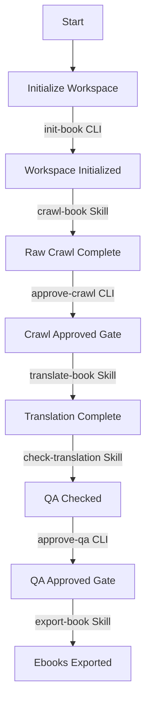

# Dich Truyen Agent — Claude Code Orchestration Guide

This document is the **Claude Code** mirror of [AGENTS.md](AGENTS.md). The two files describe the same Chinese→Vietnamese novel translation pipeline; the only difference is the runtime conventions (Skill tool, Agent tool, Bash tool, Workflow tool, hooks) used by Claude Code instead of Antigravity's `invoke_subagent` / `run_command`.

Both runtimes are maintained in parallel. Antigravity users follow `AGENTS.md` + `.agent/skills/*`; Claude Code users follow this file + `.claude/skills/*`.

## 1. Workspace Lifecycle & Gates

The novel workspace evolves through a series of deterministic gates. Downstream phases are strictly blocked until preceding gates are satisfied.



Each gate is verified using the CLI helper (Bash tool):
```powershell
$env:PYTHONUTF8=1
uv run python main.py check-gate --workspace books/<book-slug> --type <crawl-approved|qa-approved>
```

---

## 2. Pipeline Skills & Entry Points

Use the **Skill tool** to invoke each phase's skill. The skill content is loaded into your context — follow it directly. Do not use the Read tool on skill files.

### Phase 1: Setup & Initialization
* **Responsibility**: Initialize a clean book directory and build Pydantic schemas.
* **Retrieve Metadata**: To prevent request blocking/security issues on target sites, fetch page content via the Bash tool with a custom user-agent and site encoding (e.g., `gbk` or `utf-8`):
  ```powershell
  $env:PYTHONUTF8=1
  uv run python -c "import httpx; from bs4 import BeautifulSoup; r = httpx.get('<source-url>', headers={'User-Agent': 'Mozilla/5.0 (Windows NT 10.0; Win64; x64) AppleWebKit/537.36 (KHTML, like Gecko) Chrome/120.0.0.0 Safari/537.36'}, follow_redirects=True, timeout=15); html = r.content.decode('gbk', errors='ignore'); soup = BeautifulSoup(html, 'lxml'); print('Title:', soup.title.string.strip() if soup.title else None); print('H1:', soup.find('h1').text.strip() if soup.find('h1') else None); import re; author = re.search(r'作者：([^\r\n\xa0　]+)', soup.get_text()); print('Author:', author.group(1).strip() if author else None)"
  ```
* **Entry Point**: Run the CLI setup:
  ```powershell
  $env:PYTHONUTF8=1
  uv run python main.py init-book --slug <book-slug> --title "<title>" --source-url "<source-url>" [--author "<author>"]
  ```

### Phase 2: Crawling & Checkpoint Approval
* **Responsibility**: Crawl Chinese chapters and secure a `crawl-approved` checkpoint.
* **Skill**: `Skill("crawl-book")` — see [.claude/skills/crawl-book/SKILL.md](.claude/skills/crawl-book/SKILL.md)
* **Approving Crawl**:
  ```powershell
  $env:PYTHONUTF8=1
  uv run python main.py approve-crawl --workspace books/<book-slug>
  ```

### Phase 3: Sequential Translation & Subagent Isolation
* **Responsibility**: Translate chapters **strictly in sequential order** using context-isolated `translator` subagents to preserve main-agent context token efficiency.
* **Skill**: `Skill("translate-book")` — see [.claude/skills/translate-book/SKILL.md](.claude/skills/translate-book/SKILL.md)
* **Two execution paths**:
  - **Manual loop** — follow the skill's 8 steps one chapter at a time (best for small batches and troubleshooting).
  - **Workflow orchestration** — invoke `Workflow({ name: "translate-book", args: { workspace: "books/<book-slug>" } })` for long unattended runs. See [.claude/workflows/translate-book.js](.claude/workflows/translate-book.js). The workflow runs the same sequential loop with deterministic resumability via `resumeFromRunId`.

### Phase 4: Quality Assurance & QA Approval
* **Responsibility**: Scan translation outputs for errors (residue, formatting, length anomalies) and approve.
* **Skill**: `Skill("check-translation")` — see [.claude/skills/check-translation/SKILL.md](.claude/skills/check-translation/SKILL.md)
* **Approving QA**:
  ```powershell
  $env:PYTHONUTF8=1
  uv run python main.py approve-qa --workspace books/<book-slug>
  ```

### Phase 5: Ebook and Derivative Export
* **Responsibility**: Run EPUBCheck and compile the book into canonical EPUB and optional formats (AZW3, MOBI, PDF).
* **Skill**: `Skill("export-book")` — see [.claude/skills/export-book/SKILL.md](.claude/skills/export-book/SKILL.md)

---

## 3. Claude Code Capabilities Used

This project leverages four Claude Code capabilities. Use them as listed; do not substitute external mechanisms.

| Capability | Where | Purpose |
| :--- | :--- | :--- |
| **Skills** | `.claude/skills/{crawl-book,translate-book,check-translation,export-book}/SKILL.md` | Step-by-step playbooks for each pipeline phase. Invoke via the Skill tool. |
| **Subagent** | `.claude/agents/translator.md` | Locked-down Chinese→Vietnamese translator. Spawn via `Agent({subagent_type: "translator", ...})`. Tool allowlist: Read, Write, Glob, Grep only — no Bash, no WebFetch. |
| **Workflow** | `.claude/workflows/translate-book.js` | Deterministic sequential orchestrator for long translation runs. Provides resumability via `runId`, schema-validated subagent returns, and clean phase grouping. |
| **Hooks** | `.claude/settings.json` + `.claude/hooks/check_external_llm.py` | PreToolUse guardrail that blocks any Bash command importing banned LLM libraries, referencing banned API endpoints, or using banned env vars. |

---

## 4. Global Orchestration Guardrails

These rules apply to **all** Claude Code sessions working on this project.

### Token & Context Protection
* **Strict Constraint**: Never read raw source Chinese files or completed Vietnamese chapters into your own Main Agent session. Reading raw files quickly overwhelms the context window.
* **Subagent Isolation**: Always spawn the `translator` subagent for individual translation tasks (see `Skill("translate-book")`). The subagent is the only worker that performs file-level reading of raw Chinese / completed Vietnamese chapters.
* **Lightweight Verification**: After the subagent finishes, verify staging output with `Read(..., limit: 3)` — do not read the full file.

### Sequential Order & Context Handoff
* Chapters must be translated **strictly in order**. Translating `N+1` before `N` is promoted is forbidden — it corrupts pronoun (xưng hô) continuity.
* The translation of Chapter `N` must use the Vietnamese output of Chapter `N-1` as narrative context.
* If a gap or preceding missing chapter is discovered, stop execution and report it to the user.

### Strict External LLM API Prohibition
* You are strictly forbidden from using external LLM APIs (OpenRouter, OpenAI, Gemini, DeepSeek, Anthropic via Python/curl) to perform the translation.
* You MUST only use the native `Agent({subagent_type: "translator", ...})` capability for translation.
* The PreToolUse hook at `.claude/hooks/check_external_llm.py` will block any Bash command that:
  - Contains a banned env var (`OPENAI_API_KEY`, `OPENROUTER_API_KEY`, `ANTHROPIC_API_KEY`, `GEMINI_API_KEY`, `DEEPSEEK_API_KEY`)
  - References a banned endpoint (`api.openai.com`, `openrouter.ai`, `api.anthropic.com`, `generativelanguage.googleapis.com`, `api.deepseek.com`)
  - Invokes a `.py` file that imports `openai`, `anthropic`, `google.generativeai`, or `openrouter`
  - Invokes a `.py` file that references any banned endpoint hostname

### Failure Handling & Resumption
* **Retries**: Translation retries default to 3 attempts with polite backoffs (5s between attempts).
* **Halt on Failure**: Exhausted retries must stop the workflow immediately rather than letting lower-quality / empty downstream translations continue.
* **Resumability**: On failure, keep the workspace clean up to the last promoted chapter so the run can be resumed later. The Workflow tool can resume from a prior `runId` via `Workflow({scriptPath, resumeFromRunId})`.

### Environment & Console Compatibility
* **Unicode / UTF-8**: Always run CLI commands with `PYTHONUTF8=1` to prevent Windows encoding errors (`UnicodeEncodeError`):
  ```powershell
  $env:PYTHONUTF8=1
  uv run python main.py <command>
  ```
* **Cache Directory** (when needed for sandboxed test runs):
  ```powershell
  $env:UV_CACHE_DIR="$PWD\.uv-cache"
  ```

---

## 5. Quick Reference

| Goal | Command / Tool |
| :--- | :--- |
| Initialize a new book | `Bash`: `uv run python main.py init-book ...` |
| Crawl chapters | `Skill("crawl-book")` |
| Translate (manual loop) | `Skill("translate-book")` |
| Translate (unattended bulk) | `Workflow({ name: "translate-book", args: { workspace: "books/<slug>" } })` |
| QA the translations | `Skill("check-translation")` |
| Export ebooks | `Skill("export-book")` |
| Check gate status | `Bash`: `uv run python main.py check-gate --workspace books/<slug> --type <gate>` |
