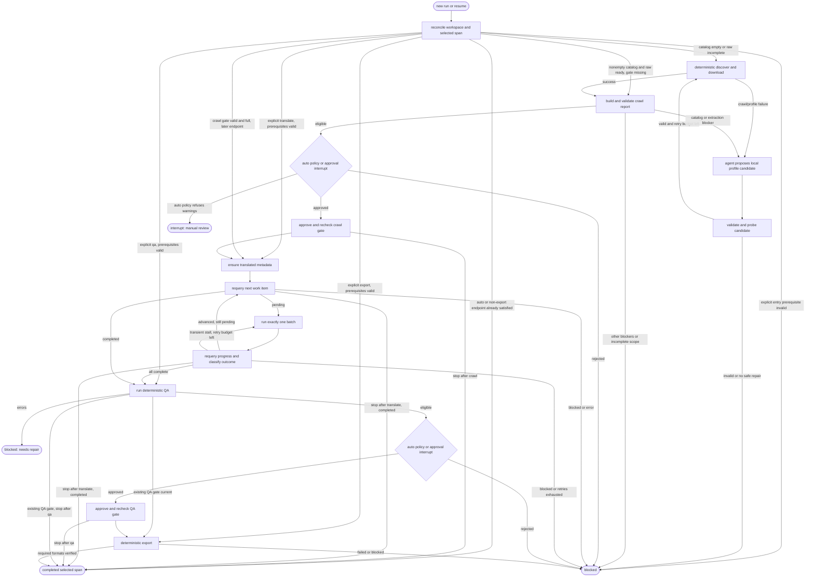

# Agent Orchestrator with LangGraph and Harness Runner Abstraction (Agy-first)

- **Date:** 2026-09-25
- **Status:** Revised design, pending review
- **Initial harness:** Antigravity CLI (`agy`), subject to the capability check in Section 3
- **Engine:** LangGraph StateGraph with SQLite checkpoints

## 1. Goal and boundaries

Run a previously initialized novel workspace through any selected span of crawl, translation, QA, and export with bounded agent sessions, durable pause/resume, and compact operational logs. A new run may start directly at a later phase when its prerequisite workspace evidence is current; it never has to replay earlier phases merely because there is no older LangGraph thread. The orchestrator manages the lifecycle; existing workspace files and checkpoint gates remain authoritative. It never reads raw Chinese chapters or full Vietnamese translations into graph state or logs, and it never calls an external LLM API to translate.

An `orchestrate` run requires an existing workspace created by `init-book` with the user-confirmed style. Book initialization, source metadata selection, and style choice are outside this command. Entry into translation or any later phase requires a full crawl approval covering the discovered catalog. Partial crawl approvals remain useful for other workflows but cannot silently become full-book orchestration approvals.

The first implementation supports one workspace and one active orchestrator process at a time. Claude Code, OpenCode, and Codex are possible future runners, not part of the initial acceptance criteria. Avoid adding empty runner stubs until a second harness has a tested command and result contract.

## 2. Ownership and invariants

| Component | Owns | Does not own |
| --- | --- | --- |
| Workspace domain operations | `state.yaml`, `book.yaml`, `chapters.yaml`, reports, approvals, promoted chapters, export artifacts | Agent process lifecycle |
| LangGraph | Phase routing, approval interrupts, retry accounting, run identity, pause/resume cursor | Authoritative chapter or gate status |
| Harness runner | Starting and stopping one CLI process, capturing its output, reporting exit/timeout | Deciding that a chapter or gate passed |
| Antigravity agent | Diagnosing crawl failures and proposing a workspace-local profile repair, metadata translation, and exactly one compact translation batch per invocation | Routine HTTP crawling, approving gates, or running the entire book in one session |

At every phase boundary and after every harness exit, derive chapter progress and gate validity again from workspace domain operations. Graph counters are snapshots for display only. `check-gate` and the hash-backed evidence determine whether an approval is current. Extend new crawl approval evidence to include `chapters.yaml`, and new QA approval evidence to include `chapters.yaml` and `state.yaml`; the existing approval commands do not hash these files today. Do not include mutable `state.yaml` in crawl evidence, because chapter promotion changes it. Reject older approvals missing the required catalog evidence for an orchestrated full-book run and guide the operator to regenerate them. `next-translation-work-item` determines whether translation is pending, completed, or blocked. A `blocked` result, a chapter gap, or stale evidence stops execution; it is never treated as a transient process failure.

Each translation invocation has a hard upper bound of `batch_size` newly promoted chapters. A fresh Antigravity process receives a prompt for **one coordinator and one batch only**, then exits. The current `$ag-translate-book` skill describes a whole-book outer loop, so the implementation must add a documented one-batch dispatch contract or adjust the generated shared harness source and adapters before invoking that skill from the orchestrator. An unconstrained `$ag-translate-book` prompt is not a valid batch call.

## 3. Antigravity capability gate

Before implementing `AgyRunner`, run a small, non-destructive capability check on the target installation and record its results in the implementation plan:

1. Locate the executable and capture its version/help. Verify the actual non-interactive prompt syntax, output mode, timeout options, permission behavior, and exit codes. The previously proposed `agy -p ... --dangerously-skip-permissions --print-timeout ...` command is **unverified** and must not be hard-coded from this spec.
2. Confirm that a fresh CLI session discovers project `.agent/skills/ag-*` adapters, can repair a crawl profile candidate in a bounded session, and can dispatch `ag_coordinator`, which in turn dispatches `ag_translator`. If nested translation dispatch is unavailable, design an explicit native-harness fallback that still isolates each chapter; do not use an external LLM API.
3. Confirm what machine-readable events the CLI exposes. If it only provides text, logging may stream text, but tool calls and agent thoughts must not be claimed as structured events.
4. Prove that timeout or cancellation ends the entire child process tree on Windows. Confirm `stdout` and `stderr` can be drained without blocking and that a quiet, still-running process is not mistaken for a hang.

If this gate fails, stop before a run that could require agent work and report the missing capability. A QA-only or export-only run uses deterministic operations and does not require `agy` to be installed. A crawl run with pending crawl work checks the capability because automatic profile repair may need the agent; translation checks it before an agent batch or metadata task. A run whose selected endpoint is already satisfied needs no harness. The runner launches an argument vector with `shell=False`, sets `PYTHONUTF8=1`, uses the project root as `cwd`, and resolves the workspace to an absolute path. Any permission bypass is an explicit operator option, limited to the intended workspace and recorded in the run summary; it is not the default.

## 4. Architecture and interfaces

```text
src/dich_truyen_agent/orchestrator/
    __init__.py
    orchestrator.py       # run/resume API and workspace lock
    graph.py              # nodes and conditional routes
    state.py              # compact checkpoint state
    workspace_ops.py      # typed facade over existing deterministic operations
    process.py            # shared subprocess, timeout, and process-tree supervisor
    tracer.py             # live display and bounded log persistence
    models.py             # config, outcomes, and event schemas
    runners/
        base.py           # HarnessRunner protocol
        agy.py            # verified Antigravity CLI adapter
        mock.py           # controlled tests
```

`WorkspaceOps` reuses the existing deterministic crawler, crawl reporting/approval, `check_gate`, `next_translation_work_item`, QA, QA approval, and export. The orchestrator invokes `crawl-book` as a supervised Python subprocess, not through an agent. Add a JSON result mode to that CLI command so `WorkspaceOps` can parse its `OperationResult` even when the process exits with code 0. The process supervisor applies the same Windows process-tree timeout handling to deterministic crawl and harness calls. Where approval logic currently lives inside `cli.py`, move that logic into a small domain function and leave the CLI as a thin wrapper. The orchestrator must not duplicate approval criteria. Every operation returns a typed `OperationResult`; `status`, report data, and current gate checks determine the route. The current CLI prints `blocked`/`error` without a nonzero process exit code, so exit code alone is insufficient.

```python
class HarnessRunner(Protocol):
    def run_phase(
        self,
        *,
        phase: Phase,
        workspace: Path,
        prompt: str,
        timeout_seconds: int,
        on_event: Callable[[RunEvent], None],
    ) -> HarnessRunResult: ...

# HarnessRunResult includes exit_code, timed_out, cancelled,
# started_at, ended_at, stdout/stderr log paths, and failure detail.
# It does not claim domain success.
```

The runner receives prompts only for profile repair, metadata translation, and one translation batch. QA and export use deterministic workspace operations rather than skills that also approve or have different format defaults. Metadata translation, if `translated_title` or a present author translation is missing, is a separate bounded harness invocation before the first batch; it uses the existing native metadata translator and persists through `update-book-metadata`.

## 5. Graph state and execution

Checkpoint state holds only compact data:

```python
class BookOrchestratorState(TypedDict):
    workspace: str                 # absolute canonical path
    run_id: str                    # UUID; also the LangGraph thread_id
    harness: str
    config: dict                   # validated batch, timeout, format, approval settings
    start_at: str                  # auto, crawl, translate, qa, export
    stop_after: str                # crawl, translate, qa, export
    phase: str
    batch_index: int
    consecutive_batch_failures: int
    profile_repair_attempts: int
    pending_approval: str | None   # crawl or qa
    approval_report_hash: str | None
    status: str                    # running, paused, blocked, completed, error, superseded
    error_code: str | None
    error_message: str | None
    run_dir: str
```

Do not checkpoint raw source text, chapter translations, full report bodies, per-chapter arrays, or verbose logs. Display counters are computed from workspace state at the time of rendering. Store the SQLite file under the workspace run metadata directory, and store the current `run_id` in a small run manifest. `orchestrate --resume` resolves that ID and uses the same LangGraph `thread_id`; it retains the run's `start_at` and `stop_after`. A new invocation after a terminal `blocked` or `completed` run gets a new ID and reconciles the workspace. While a run is paused, a plain new invocation reports the pending resume; an explicit `--start-at` creates a new run, marks the old one `superseded` in its summary, and prevents later resumption of that thread. A workspace lock prevents simultaneous writers; release it when the CLI exits in `paused` state and reacquire it on resume or a new run.

### 5.1 Phase entry and bounded runs

`--start-at` selects the first phase the caller wants the new run to consider. `--stop-after` selects the last phase to complete; its default is `export`. `auto` chooses the earliest incomplete phase within the requested endpoint from workspace evidence, or completes immediately if that endpoint is already satisfied. An explicit start never runs an earlier phase to repair a missing prerequisite: it returns `blocked` with the missing or stale gate and the command needed to prepare it. A selected phase that is already complete is skipped, except an explicit `export` invocation may regenerate its requested formats. Once `stop_after` is satisfied, the run ends successfully with its selected span in the summary; it does not enter later phases. Require `stop_after` to be the same as or later than an explicit `start_at`.

| New run starts at | Required workspace evidence before entry | Completion of that phase |
| --- | --- | --- |
| `crawl` | Initialized `book.yaml`, style, catalog/state (empty is allowed) | Current full `crawl-approved` checkpoint, including catalog and raw evidence |
| `translate` | Current **full** `crawl-approved` checkpoint; nonempty catalog; valid raw evidence | Every catalog chapter promoted in order; `next-translation-work-item` returns `completed` |
| `qa` | Current full crawl checkpoint and complete, gap-free translations | Current `qa-approved` checkpoint after QA/approval; an existing current QA gate may be reused |
| `export` | Current full crawl checkpoint, complete translations, and current `qa-approved` checkpoint | Every requested format verified in `exports/` |

Translation has durable per-chapter promotions in `state.yaml` and translation files, but no separate `translation-completed` approval checkpoint today. The QA entry check therefore verifies all catalog chapters and the `next-translation-work-item` completion result; it must not treat a numeric count alone as proof. The QA checkpoint can be partial when a human accepted warnings, matching the current export gate behavior; automatic QA approval still requires zero findings. Gate checks must validate current hashes and the strengthened evidence requirements in Section 2. Checking prerequisites does not run their phases.

An explicit `--start-at qa` with a current QA gate and `--stop-after qa` is a successful no-op. An explicit `--start-at export` runs export using existing approvals without re-running crawl, translation, or QA. An explicit `--start-at translate` begins at the first pending chapter without opening a crawl subprocess. These new runs use new graph thread IDs even if an earlier orchestrator run never existed; a valid workspace is sufficient.



### 5.2 Crawl and crawl gate

On entry, validate `book.yaml`, `chapters.yaml`, `state.yaml`, style, and workspace path. A workspace freshly created by `init-book` has an empty catalog and state; this is valid *before discovery*, not a crawl result. If an existing **full** `crawl-approved` gate is current, skip crawl. Otherwise, when `chapters.yaml` is empty, call crawl work immediately. For an existing nonempty catalog, build a report first and run crawl work only if raw chapters are missing or failed. After the harness exits, rebuild the report and inspect `approval_blockers(report)`, `discovered_count`, `selected_count`, `completed_count`, `scope`, and warnings. Do not infer readiness from `failed_count == 0`. The full-book path requires `discovered_count > 0`, `scope == FULL`, `selected_count == discovered_count`, `completed_count == selected_count`, and no blockers. A zero-chapter catalog is always blocked from approval, even if the report currently contains no blocker.

For a new book, the orchestrator reads `source_url` and slug from `book.yaml` and runs the existing deterministic `crawl-book` operation with the workspace's books root, `--max-chapters 0`, and the configured chapter delay. That operation loads the active source-domain profile, fetches the index with its declared encoding and browser fallback, discovers and validates chapter links, writes `chapters.yaml` and matching pending chapter records in `state.yaml`, then downloads chapter bodies sequentially into `raw/`. It validates extraction, uses browser fallback and bounded retries where appropriate, writes each successful raw file and hash atomically, and skips valid completed raw files on a later invocation. A resumed crawl with a nonempty catalog reuses that catalog and downloads only pending, failed, or invalid raw artifacts. The agent is not involved in this normal path.

For a crawl or profile failure after the crawler's own bounded retries, or a catalog/extraction blocker in the crawl report, the orchestrator automatically dispatches a fresh `agy` profile-repair session. This includes a missing domain profile, failed index discovery, invalid selectors, failed chapter extraction, or invalid discovered catalog. The agent receives the source URL, active profile (if any), a compact error and report excerpt, and paths to bounded sample pages as needed. It may inspect the source site and proposes a replacement **only** in a candidate file under the current run directory; it does not call `approve-crawl`, promote a shared profile, or write `chapters.yaml`, `state.yaml`, or raw chapters. Give the repair session only the paths it needs; snapshot critical workspace file hashes before dispatch and block if the agent changed anything outside its candidate/log area. A transient outage, CAPTCHA requiring human action, workspace corruption, or a cancellation may yield `no_safe_profile_fix`; the agent must not invent a selector change merely to force a retry. Report warnings are not errors: with `--auto-approve`, unresolved warnings pause for manual review rather than silently approving or repeatedly redownloading already completed chapters.

The orchestrator validates the candidate's schema and domain with the existing `validate-crawl-profile` rules, then runs a new read-only functional probe using the same crawler/parser code: fetch the index, require a nonempty catalog with no blockers, and extract representative first, middle, and last chapters above the configured content threshold. The existing `validate-crawl-profile` CLI checks schema and domain only, so this live probe is a required new deterministic operation. If the workspace already has a nonempty catalog, the probe also compares chapter URL order against it. A mismatch is `catalog-changed` and blocks automatic replacement; the existing `crawl-book` resume path would otherwise reuse stale links. If translations or crawl approval already exist, do not automatically rebuild a catalog or replace raw evidence. A valid candidate with compatible catalog is atomically installed as workspace `crawl-profile.yaml`, and the orchestrator retries deterministic `crawl-book` from the current workspace state. Retain the previous local profile and candidate diagnostics in the run directory for inspection. Never promote a local repair into the shared domain template automatically.

Permit at most two profile-repair sessions per orchestrator run, each followed by one validated crawl retry. The crawler's own per-chapter HTTP retries are a separate budget. Stop early if the agent returns no valid candidate, the same profile hash recurs, the functional probe fails, or the failure signature repeats without raw-chapter progress. Record the last crawl error, candidate/probe outcome, and remaining work in `run_summary.json`; finish as `blocked` rather than looping indefinitely.

Neither the normal crawl subprocess nor the profile-repair agent approves crawl. The existing crawl skill combines crawling and approval, so the orchestrator does not invoke it. Auto-approval requires full scope, no blockers, and no warnings; warnings pause for a manual decision. Manual approval is a LangGraph `interrupt()` with a compact report summary and report path. The approval node must have no side effects before `interrupt()`. Save hashes of the persisted report and the raw evidence covered by it with the pending request; on resume, compare both against the current files before applying the decision. Changed evidence requires a fresh report and decision. After approval, call the shared approval operation and verify `check_gate` and full scope again.

### 5.3 Translation

After the crawl gate, ensure metadata translation is complete. For every batch, read `next-translation-work-item --json` or its domain equivalent. On `pending`, record `progress_completed` and `chapter_id`, launch exactly one coordinator with a maximum of `batch_size` chapters, and require its compact result. Regardless of agent output or process exit, requery the workspace afterward. Accept progress only when newly completed chapters form the expected contiguous sequence and their count is between 1 and `batch_size`; a jump beyond the bound is a contract violation and blocks the run. A `blocked` work item, gap, or stale gate stops immediately.

The coordinator owns up to three attempts **per chapter**, as the current translation skill specifies. The graph owns at most three **consecutive batch invocations with zero progress** for transient process failures. A batch with progress resets that outer counter, even if the process later exits abnormally; the next invocation starts at the first pending chapter. No graph retry occurs for a terminal domain blocker. Count an initial failed invocation as attempt 1 and halt when the configured limit is reached. Use bounded backoff for retryable process failures. Reconcile state before every retry so a crash after promotion cannot retranslate a completed chapter.

### 5.4 QA and QA gate

First check whether the existing `qa-approved` gate is current. If it is, proceed to export without regenerating the report: the existing QA report has a generated timestamp, so rewriting it would make its hash-backed approval stale. Otherwise run `check-translation` through deterministic workspace operations, persist `reports/qa-report.yaml`, and inspect the typed report. Any `error_count > 0` enters `blocked: needs repair` with report path; it does **not** route to translation when all chapters are complete. A later new run rechecks QA after operator repair. The orchestrator does not automatically edit translated chapters or glossary entries.

For manual mode, present errors/warnings and obtain an explicit decision through `interrupt()` before approval. For `--auto-approve`, require **zero findings** and a fresh report. This is stricter than the existing `approve-qa` command, which permits warnings and records partial scope. Manual approval may accept warnings using that existing behavior; the decision and warning count are recorded. On resume, compare the persisted report hash and hashes of all translations covered by QA; do not regenerate the report merely to test freshness. Changed evidence requires a new QA scan and decision. Then call the shared `approve-qa` operation and verify `check_gate` before export.

### 5.5 Export

Export through the deterministic `export_book` operation. Default requested formats are `epub,azw3`; MOBI and PDF require an explicit `--formats` value. EPUB is required. Every explicitly requested format must have a successful result and an output file before the orchestrator reports `completed`. If Calibre is missing and a requested derivative is skipped, report `blocked` with the actionable export result; do not silently mark the run successful. Recheck the QA gate before export. The output format policy belongs to the orchestrator config, not to a free-form agent prompt.

## 6. Resume, retries, and failure handling

Workspace files win whenever a SQLite snapshot and file state differ. Graph checkpoints are execution cursors, not transactions spanning CLI child processes and workspace writes. Each side-effecting node must recheck its precondition at entry and its postcondition on exit. A replayed node may skip work already proven complete, but must not overwrite a promoted chapter or create duplicate approvals based solely on its checkpoint state.

`interrupt()` is used only in approval-decision nodes; approval writes happen in separate nodes after resume. The CLI must surface pending approval and exit as `paused`, rather than waiting on stdin during an unattended run. `--resume --decision approve|reject` resumes the current pending interrupt using the saved thread ID. `--resume` without `--decision` resumes a crash or stopped run only when no approval decision is pending. Resume keeps the original phase span; combining `--resume` with `--start-at` or `--stop-after` is invalid. To start a different phase, create a new run with `--start-at`; that needs valid workspace evidence, not the old run's SQLite checkpoint. Rejection ends that run as `blocked`. After correcting workspace data or rejecting a gate, a new invocation starts a new run and reevaluates the workspace. If a process crashed after approval but before its graph checkpoint, the replay checks the existing gate and skips the approval write.

Timeouts are wall-clock limits on individual harness and deterministic crawl subprocess invocations. Set separate defaults for a translation batch and a potentially much longer crawl, both configurable. A lack of stdout alone is not a hang signal. On timeout or cancellation, terminate the whole child process tree, wait for pipes to close, flush logs, then reconcile workspace before retrying or stopping. Unexpected graph/domain errors surface as `error`; gate failures and operator-repair cases surface as `blocked`. No phase retries indefinitely.

## 7. CLI contract

```powershell
$env:PYTHONUTF8=1
uv run python main.py orchestrate --workspace books/<slug> `
    [--start-at auto|crawl|translate|qa|export] `
    [--stop-after crawl|translate|qa|export] `
    [--harness agy] [--auto-approve] [--batch-size 5] `
    [--batch-timeout 1800] [--crawl-timeout 21600] `
    [--profile-repair-attempts 2] `
    [--formats epub,azw3] [--log-level compact|verbose] `
    [--allow-harness-permission-bypass]

uv run python main.py orchestrate --workspace books/<slug> --resume
uv run python main.py orchestrate --workspace books/<slug> --resume --decision approve
uv run python main.py orchestrate --workspace books/<slug> --resume --decision reject

# New run from an existing full crawl checkpoint: translate only
uv run python main.py orchestrate --workspace books/<slug> --start-at translate --stop-after translate

# New run using existing crawl and QA evidence: export only
uv run python main.py orchestrate --workspace books/<slug> --start-at export --stop-after export
```

These commands describe the interface to implement; they are not present in `main.py` yet. Effective batch size follows explicit CLI argument, project `.env` `DICH_TRUYEN_TRANSLATION_BATCH_SIZE`, then default 5. Validate positive sizes and timeouts; validate `--profile-repair-attempts` as a nonnegative integer, default 2. `--auto-approve` is an opt-in policy for eligible reports, not permission for an agent to approve its own work. The CLI prints the run ID, selected phase span, status, pending gate/report path when paused, and the next resume command. Exit codes are 0 for completed, 2 for paused, 3 for blocked, and 1 for unexpected error; internal routing still uses typed operation results rather than exit codes alone.

## 8. Tracing and artifacts

Use an unambiguous UUID run directory under `books/<slug>/reports/runs/<run_id>/` with a compact `run_summary.json` and one log per harness invocation. Persist timestamps, phase, attempt, process exit/timeout, before/after chapter counts, report paths, gate decisions, requested formats, and final outcome. The terminal shows phase milestones and elapsed time. Drain stdout and stderr concurrently, preserving their source. Raw text logs are bounded or rotated for long runs and are not copied into LangGraph state. Avoid recording secrets and full chapter contents; verbose mode means available CLI output, not a promise of private agent thoughts or structured tool-call events. SQLite checkpoints need a retention/cleanup policy for completed runs, while run summaries remain available for diagnosis.

## 9. Dependencies and implementation sequence

After the Antigravity capability gate, resolve a **compatible, currently supported** LangGraph and SQLite checkpointer pair for Python 3.13, then commit exact versions in `uv.lock`. Do not carry forward the earlier `langgraph>=0.2,<1` and `langgraph-checkpoint-sqlite>=2,<3` ranges without checking the current APIs and resolver. Configure the SQLite checkpointer's safe deserialization options if required by the selected release.

Implement in this order: (1) capability check and one-batch harness contract; (2) deterministic crawl JSON result, read-only profile probe, and shared approval operations; (3) shared process supervisor and Antigravity repair runner; (4) graph and SQLite resume; (5) tracer and CLI; (6) smoke run. This order proves both crawl and harness contracts before building the graph around them.

## 10. Acceptance tests

1. A mock two-batch full-book run creates only full crawl approval, advances chapters sequentially, passes QA, and exports the requested formats.
2. Manual crawl and QA gates pause before approval. No skill or subprocess approves them. Resume with the same thread ID and unchanged report succeeds; changed report/evidence requires a fresh decision.
3. A newly initialized empty-catalog workspace enters discovery before any crawl report or approval decision. Zero discovered chapters cannot be approved. Auto-approval refuses crawl blockers, partial crawl scope, crawl warnings, QA errors, and QA warnings. Manual QA may approve warnings and records that decision. Changing `chapters.yaml` invalidates either approval; changing `state.yaml` after QA invalidates QA approval without invalidating the earlier crawl approval.
4. A coordinator promotes no more than `batch_size` new chapters per invocation. A gap or promotion beyond the bound blocks immediately.
5. A process crash after `promote-chapter`, after crawl approval, and after QA approval resumes without repeating completed work or losing the next pending chapter.
6. `OperationResult.status == blocked/error` is honored even when the deterministic CLI process exits with code 0. Timeout ends all descendants and captures both output streams.
7. Three consecutive zero-progress transient batch failures stop; progress resets the outer counter. Per-chapter retries remain bounded independently. Domain blockers are never retried automatically.
8. QA errors in an otherwise fully translated book enter `needs repair` without a translation loop. A new run after repair reruns QA.
9. Missing EPUBCheck blocks required EPUB export. Missing Calibre blocks an explicitly requested derivative; the default and configured format policies are tested separately.
10. A missing profile, broken index selector, and broken chapter selector each invoke an isolated agent repair session, validate a workspace-local candidate, and retry deterministic crawl. The agent never approves crawl or changes book state directly; an attempted unauthorized workspace mutation is detected and blocks the run. An invalid candidate, repeated signature with no progress, and exhausted repair budget block cleanly.
11. A read-only profile probe rejects an empty/wrong catalog and chapter extraction below threshold. A changed catalog order with existing state blocks automatic replacement instead of retrying against stale links. A repaired local profile does not change the shared domain template.
12. A real two-chapter Antigravity smoke workspace proves profile repair, skill discovery, nested translator dispatch, one-batch termination, logs, SQLite pause/resume, and EPUB output before attempting a long unattended run.
13. A fresh `--start-at crawl --stop-after crawl` run accepts an empty catalog, stops after a valid crawl approval, and never enters metadata or translation. A fresh `--start-at translate --stop-after translate` run succeeds using a valid crawl checkpoint without an earlier graph run or a crawl call; missing, stale, or partial crawl approval blocks without backtracking. It starts from the first pending chapter and completes at the requested endpoint.
14. A fresh `--start-at qa --stop-after qa` run requires complete, gap-free translations and a current full crawl checkpoint, blocks without translating missing chapters, and can reuse a current QA checkpoint without rewriting the report. A fresh `--start-at export --stop-after export` run uses current prerequisite gates without `agy` or earlier phase invocations; stale QA or crawl evidence blocks.
15. A paused or crashed run resumes at its saved node and endpoint. `--resume` with a new phase selector is rejected. A new run from another phase works from workspace evidence even if no prior SQLite thread exists; starting it supersedes an older paused run and prevents stale resume. `auto` stops at a satisfied `--stop-after` endpoint without running later phases.

Run tests and quality checks with `PYTHONUTF8=1` and workspace-local `UV_CACHE_DIR` on Windows.
