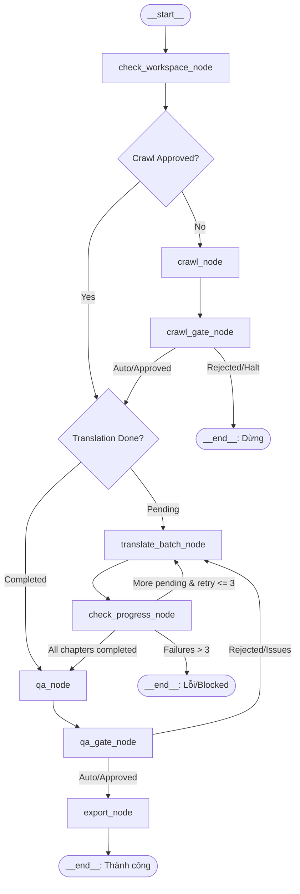

# Agent Orchestrator with LangGraph and Harness Runner Abstraction (Agy-first)

- **Date:** 2026-09-25
- **Status:** Proposed / Approved Design
- **Target Harness:** Antigravity CLI (`agy`), extensible to Claude Code, OpenCode, Codex.
- **Engine:** LangGraph StateGraph with SQLite Checkpointing.

---

## 1. Context & Motivation

Dich Truyen Agent currently relies on an operator manually entering skill slash-commands (`$ag-crawl-book`, `$ag-translate-book`, etc.) inside an active agent session (e.g. Antigravity IDE, Claude Code).

For 1000+ chapter novels and long unattended runs (such as overnight translation):
1. **Context Explosion:** Running a long translation session in a single conversational session risks context degradation and memory pressure.
2. **Lack of Automation:** An operator must be present to review gates, trigger subsequent batches, and run QA and export steps manually.
3. **Session Hangs & Transient Failures:** Network glitches, rate limits, or agent hangs can stall the workflow without automated supervision, timeout recovery, or structured retry backoff.
4. **Observability Needs:** Operators need to observe real-time agent activities (tool calls, current steps, chapter progress) and access organized post-mortem logs when debugging failed batches.

This design introduces a standalone **Python Agent Orchestrator** powered by **LangGraph**, utilizing a **Harness Runner Abstraction** that initially optimizes for **Antigravity CLI (`agy`)**.

---

## 2. Core Architectural Principles

1. **Separation of Concerns:** 
   - **Orchestrator (LangGraph):** Manages high-level pipeline lifecycle, gates, batch iterations, failure recovery, and state transitions.
   - **Harness Runner (`AgyRunner`):** Isolates the mechanics of spawning CLI subprocesses, flag mapping, real-time output streaming, and timeout handling.
   - **Agent Harness (`agy.exe`):** Executes domain tasks (crawling, translation, QA, export) utilizing existing harness skills (`$ag-*`) and subagents (`ag_coordinator`, `ag_translator`).
2. **Fresh-Session Loop:**
   - Translating a book is divided into bounded batches (default: 5 chapters).
   - Each batch runs in a **fresh, isolated CLI subprocess** of `agy.exe`. This guarantees 100% clean context for each batch, completely eliminating context bloating across 1000+ chapter runs.
3. **No External LLM API Guardrail Preserved:**
   - The Orchestrator and LangGraph perform only process management, state tracking, and workspace file verification.
   - No direct external LLM API calls (OpenAI, Anthropic, Gemini API) are introduced in Python code. All cognitive reasoning is delegated to the harness agent.
4. **Workspace State as Source of Truth:**
   - Durable workspace files (`state.yaml`, `book.yaml`, `chapters.yaml`, `checkpoints/*.yaml`) remain the authoritative source of truth.
   - LangGraph's internal graph state acts as an in-memory projection and execution tracker, backed by SQLite checkpoints for graph-level pausing and resumption.

---

## 3. System Architecture & Module Structure

New files will be located in `src/dich_truyen_agent/orchestrator/`:

```text
src/dich_truyen_agent/
├── orchestrator/
│   ├── __init__.py
│   ├── orchestrator.py        # BookOrchestrator interface wrapping compiled graph
│   ├── graph.py               # LangGraph StateGraph definition, nodes, conditional edges
│   ├── state.py               # BookOrchestratorState TypedDict definition
│   ├── tracer.py              # ActivityTracer: Live console streaming & log persistence
│   ├── runners/
│   │   ├── __init__.py
│   │   ├── base.py            # BaseHarnessRunner (Abstract Base Class)
│   │   ├── agy.py             # AgyRunner (Optimized Antigravity CLI runner)
│   │   ├── claude.py          # ClaudeCodeRunner (Stub for future extension)
│   │   └── mock.py            # MockRunner (For automated unit & integration testing)
│   └── models.py              # Dataclasses/Pydantic schemas for configs and run events
```

### Module Responsibilities

- **`BaseHarnessRunner` (`runners/base.py`):**
  Defines the abstract interface for invoking harness commands:
  ```python
  class BaseHarnessRunner(ABC):
      @abstractmethod
      def run_phase(
          self,
          phase: str,
          workspace: Path,
          prompt: str,
          timeout: int,
          on_log_line: Optional[Callable[[str], None]] = None,
      ) -> HarnessRunResult: ...
  ```

- **`AgyRunner` (`runners/agy.py`):**
  Implements execution for `agy.exe`:
  - Command: `agy -p "<prompt>" --dangerously-skip-permissions --print-timeout <timeout_sec>`
  - Environment: Inherits parent environment with `$env:PYTHONUTF8=1` and set `cwd` to project root.
  - Subprocess Management: Spawns non-blocking subprocess with `stdout=PIPE`, reads line-by-line in real-time, forwards lines to `ActivityTracer`, and tracks process heartbeat.
  - Timeout enforcement: Force-terminates process tree if timeout is exceeded.

- **`ActivityTracer` (`tracer.py`):**
  - Live Console Renderer: Formats log lines with timestamps and phase tags. Supports `compact` mode (milestones & tool calls) and `verbose` mode (raw agent thoughts and tool outputs).
  - File Persistence: Writes structured session logs to `books/<slug>/reports/runs/run_<YYYYMMDD_HHMMSS>/`.

- **`graph.py` & `orchestrator.py`:**
  Builds and compiles the `StateGraph`, connecting nodes to `AgyRunner` and workspace status functions.

---

## 4. LangGraph State Machine Specification

### 4.1. State Schema

```python
from typing import TypedDict, Optional, List

class BookOrchestratorState(TypedDict):
    workspace: str
    slug: str
    harness: str
    auto_approve: bool
    batch_size: int
    timeout: int
    
    # Progress counters
    total_chapters: int
    completed_chapters: int
    pending_chapters: int
    consecutive_failures: int
    
    # Checkpoint and Gate statuses
    crawl_completed: bool
    crawl_approved: bool
    qa_completed: bool
    qa_approved: bool
    export_completed: bool
    
    # Error tracking
    status: str  # "running", "paused", "completed", "blocked", "error"
    error_message: Optional[str]
    run_dir: str
```

### 4.2. Graph Nodes & Transitions



#### Node Details:

1. **`check_workspace_node`:**
   - Validates existence of `books/<slug>/book.yaml`.
   - Initializes `BookOrchestratorState` with total chapters and current progress.

2. **`crawl_node`:**
   - Executes `$ag-crawl-book books/<slug>` via `AgyRunner`.
   - Parses `reports/crawl.yaml` to confirm download statistics.

3. **`crawl_gate_node` (Gate 1):**
   - If `auto_approve` is `True` and `failed_count == 0`: calls `approve_crawl(workspace)` directly.
   - If `auto_approve` is `False`: calls LangGraph's `interrupt()` or interactive CLI prompt, displaying crawl stats and awaiting user confirmation `[y/N]`.

4. **`translate_batch_node`:**
   - Queries `next-translation-work-item`.
   - Invokes `$ag-translate-book books/<slug>` via `AgyRunner`.
   - Streams output to `ActivityTracer` and per-batch log file.

5. **`check_progress_node`:**
   - Re-checks `next-translation-work-item`.
   - If progress advanced: resets `consecutive_failures = 0`.
   - If progress stalled or process crashed: increments `consecutive_failures += 1`.
   - Router routes to `translate_batch_node` if pending > 0 and `consecutive_failures <= 3`, to `qa_node` if pending == 0, or to `__end__` if max failures reached.

6. **`qa_node`:**
   - Executes `$ag-check-translation books/<slug>` via `AgyRunner`.
   - Reads `reports/qa-report.yaml`.

7. **`qa_gate_node` (Gate 2):**
   - If `auto_approve` is `True` and zero blockers found: calls `approve_qa(workspace)`.
   - If `auto_approve` is `False`: calls `interrupt()` / prompt with QA summary.

8. **`export_node`:**
   - Executes `$ag-export-book books/<slug> epub,azw3,mobi,pdf`.
   - Verifies output files in `books/<slug>/exports/`.

---

## 5. Observability, Tracing & Logging

Every execution run creates a unique run artifact directory:
```text
books/<book-slug>/reports/runs/run_<YYYYMMDD_HHMMSS>/
├── run_summary.json          # Overall timing, configuration, chapters processed, error logs
├── 01_crawl.log              # Raw stdout/stderr of crawl step
├── 02_translate_batch_001.log# Subprocess logs for Batch 1
├── 02_translate_batch_002.log# Subprocess logs for Batch 2
├── 03_qa.log                 # Subprocess logs for QA step
└── 04_export.log             # Subprocess logs for Export step
```

### Terminal Live Activity Display (Tracer)
- Milestone banners indicating current state, batch index, and completion percentage.
- Real-time tool call summaries parsed from stdout (e.g. `[AGY] Tool Call: promote-chapter [OK]`).
- Visual heartbeat indicator showing elapsed time and active worker status.

---

## 6. CLI Command Interface

Integrated into `main.py`:

```powershell
uv run python main.py orchestrate `
    --workspace books/<book-slug> `
    --harness agy `
    [--auto-approve] `
    [--batch-size 5] `
    [--timeout 900] `
    [--log-level compact|verbose]
```

### Arguments:
- `--workspace`: Path to book workspace (e.g. `books/mo-ri-zhang-lang`).
- `--harness`: Agent harness name. Default: `agy`.
- `--auto-approve`: Flag to automatically approve crawl and QA checkpoints if quality checks pass with 0 errors.
- `--batch-size`: Translation batch size per agent session. Defaults to 5 (or `.env` setting).
- `--timeout`: Maximum seconds allowed per subprocess execution before timeout termination (default: 900s).
- `--log-level`: `compact` (clean progress indicators and milestones) or `verbose` (full raw stream).

---

## 7. Dependencies

Add to `pyproject.toml`:
```toml
dependencies = [
    # existing dependencies...
    "langgraph>=0.2,<1",
    "langgraph-checkpoint-sqlite>=2.0,<3",
]
```

---

## 8. Testing & Verification Plan

1. **Unit Testing (`tests/test_orchestrator.py`):**
   - Test `MockRunner` executing Happy Path (Crawl -> Gate 1 -> 2 Translation Batches -> Gate 2 -> Export).
   - Test Batch Failure & Retry Recovery (Batch 1 fails on attempt 1, succeeds on attempt 2).
   - Test Max Retries Blocker (3 consecutive failures halts graph cleanly with `status="error"`).
   - Test Gate Approvals (Auto-approve vs User Rejection).
2. **LangGraph Checkpoint Recovery Test:**
   - Execute graph halfway through translation, simulate interruption, resume with identical thread ID, and verify continuation without re-translating completed chapters.
3. **Integration Smoke Test with Real `agy`:**
   - Run a 2-chapter smoke novel using `agy.exe` with `--auto-approve`.
   - Verify subprocess spawning, real-time log streaming, log file generation in `reports/runs/`, and EPUB output.
4. **Code Quality:**
   - `uv run pytest tests/test_orchestrator.py`
   - `uv run ruff check src/dich_truyen_agent/orchestrator tests/test_orchestrator.py`
   - `uv run ruff format --check`
