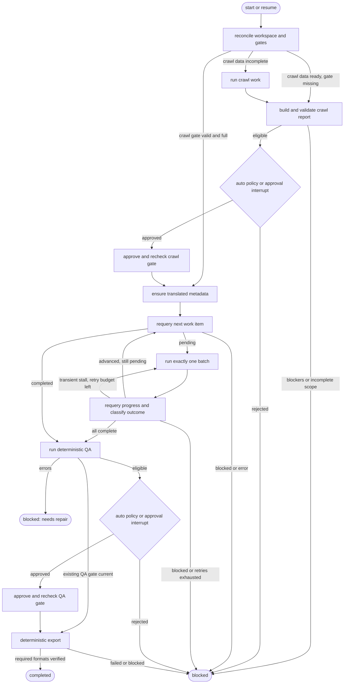

# Agent Orchestrator with LangGraph and Harness Runner Abstraction (Agy-first)

- **Date:** 2026-09-25
- **Status:** Revised design, pending review
- **Initial harness:** Antigravity CLI (`agy`), subject to the capability check in Section 3
- **Engine:** LangGraph StateGraph with SQLite checkpoints

## 1. Goal and boundaries

Run a previously initialized novel workspace through crawl, translation, QA, and export with bounded agent sessions, durable pause/resume, and compact operational logs. The orchestrator manages the lifecycle; existing workspace files and checkpoint gates remain authoritative. It never reads raw Chinese chapters or full Vietnamese translations into graph state or logs, and it never calls an external LLM API to translate.

An `orchestrate` run requires an existing workspace created by `init-book` with the user-confirmed style. Book initialization, source metadata selection, and style choice are outside this command. A full-book run requires a full crawl approval covering the discovered catalog. Partial crawl approvals remain useful for other workflows but cannot silently become full-book orchestration approvals.

The first implementation supports one workspace and one active orchestrator process at a time. Claude Code, OpenCode, and Codex are possible future runners, not part of the initial acceptance criteria. Avoid adding empty runner stubs until a second harness has a tested command and result contract.

## 2. Ownership and invariants

| Component | Owns | Does not own |
| --- | --- | --- |
| Workspace domain operations | `state.yaml`, `book.yaml`, `chapters.yaml`, reports, approvals, promoted chapters, export artifacts | Agent process lifecycle |
| LangGraph | Phase routing, approval interrupts, retry accounting, run identity, pause/resume cursor | Authoritative chapter or gate status |
| Harness runner | Starting and stopping one CLI process, capturing its output, reporting exit/timeout | Deciding that a chapter or gate passed |
| Antigravity agent | Crawl work needing agent judgment, metadata translation, and exactly one compact translation batch per invocation | Approving gates or running the entire book in one session |

At every phase boundary and after every harness exit, derive chapter progress and gate validity again from workspace domain operations. Graph counters are snapshots for display only. `check-gate` and the hash-backed evidence determine whether an approval is current. Extend new crawl approval evidence to include `chapters.yaml`, and new QA approval evidence to include `chapters.yaml` and `state.yaml`; the existing approval commands do not hash these files today. Do not include mutable `state.yaml` in crawl evidence, because chapter promotion changes it. Reject older approvals missing the required catalog evidence for an orchestrated full-book run and guide the operator to regenerate them. `next-translation-work-item` determines whether translation is pending, completed, or blocked. A `blocked` result, a chapter gap, or stale evidence stops execution; it is never treated as a transient process failure.

Each translation invocation has a hard upper bound of `batch_size` newly promoted chapters. A fresh Antigravity process receives a prompt for **one coordinator and one batch only**, then exits. The current `$ag-translate-book` skill describes a whole-book outer loop, so the implementation must add a documented one-batch dispatch contract or adjust the generated shared harness source and adapters before invoking that skill from the orchestrator. An unconstrained `$ag-translate-book` prompt is not a valid batch call.

## 3. Antigravity capability gate

Before implementing `AgyRunner`, run a small, non-destructive capability check on the target installation and record its results in the implementation plan:

1. Locate the executable and capture its version/help. Verify the actual non-interactive prompt syntax, output mode, timeout options, permission behavior, and exit codes. The previously proposed `agy -p ... --dangerously-skip-permissions --print-timeout ...` command is **unverified** and must not be hard-coded from this spec.
2. Confirm that a fresh CLI session discovers project `.agent/skills/ag-*` adapters and can dispatch `ag_coordinator`, which in turn dispatches `ag_translator`. If nested dispatch is unavailable, design an explicit native-harness fallback that still isolates each chapter; do not use an external LLM API.
3. Confirm what machine-readable events the CLI exposes. If it only provides text, logging may stream text, but tool calls and agent thoughts must not be claimed as structured events.
4. Prove that timeout or cancellation ends the entire child process tree on Windows. Confirm `stdout` and `stderr` can be drained without blocking and that a quiet, still-running process is not mistaken for a hang.

If this gate fails, stop before a real-book run and report the missing capability. The runner launches an argument vector with `shell=False`, sets `PYTHONUTF8=1`, uses the project root as `cwd`, and resolves the workspace to an absolute path. Any permission bypass is an explicit operator option, limited to the intended workspace and recorded in the run summary; it is not the default.

## 4. Architecture and interfaces

```text
src/dich_truyen_agent/orchestrator/
    __init__.py
    orchestrator.py       # run/resume API and workspace lock
    graph.py              # nodes and conditional routes
    state.py              # compact checkpoint state
    workspace_ops.py      # typed facade over existing deterministic operations
    tracer.py             # live display and bounded log persistence
    models.py             # config, outcomes, and event schemas
    runners/
        base.py           # HarnessRunner protocol
        agy.py            # verified Antigravity CLI adapter
        mock.py           # controlled tests
```

`WorkspaceOps` reuses the existing domain functions and CLI behavior for crawl reporting/approval, `check_gate`, `next_translation_work_item`, QA, QA approval, and export. Where approval logic currently lives inside `cli.py`, move that logic into a small domain function and leave the CLI as a thin wrapper. The orchestrator must not duplicate approval criteria. Every operation returns a typed `OperationResult`; `status`, report data, and current gate checks determine the route. The current CLI prints `blocked`/`error` without a nonzero process exit code, so exit code alone is insufficient.

```python
class HarnessRunner(Protocol):
    def run_phase(
        self,
        *,
        phase: Phase,
        workspace: Path,
        prompt: str,
        timeout_seconds: int,
        on_event: Callable[[RunEvent], None],
    ) -> HarnessRunResult: ...

# HarnessRunResult includes exit_code, timed_out, cancelled,
# started_at, ended_at, stdout/stderr log paths, and failure detail.
# It does not claim domain success.
```

The runner receives phase-specific prompts. Crawl prompts explicitly stop before `approve-crawl`; QA and export use deterministic workspace operations rather than skills that also approve or have different format defaults. Metadata translation, if `translated_title` or a present author translation is missing, is a separate bounded harness invocation before the first batch; it uses the existing native metadata translator and persists through `update-book-metadata`.

## 5. Graph state and execution

Checkpoint state holds only compact data:

```python
class BookOrchestratorState(TypedDict):
    workspace: str                 # absolute canonical path
    run_id: str                    # UUID; also the LangGraph thread_id
    harness: str
    config: dict                   # validated batch, timeout, format, approval settings
    phase: str
    batch_index: int
    consecutive_batch_failures: int
    pending_approval: str | None   # crawl or qa
    approval_report_hash: str | None
    status: str                    # running, paused, blocked, completed, error
    error_code: str | None
    error_message: str | None
    run_dir: str
```

Do not checkpoint raw source text, chapter translations, full report bodies, per-chapter arrays, or verbose logs. Display counters are computed from workspace state at the time of rendering. Store the SQLite file under the workspace run metadata directory, and store the current `run_id` in a small run manifest. `orchestrate --resume` resolves that ID and uses the same LangGraph `thread_id`. A new `orchestrate` invocation after a terminal `blocked` or `completed` run gets a new ID and starts by reconciling the workspace. A workspace lock prevents simultaneous writers; release it when the CLI exits in `paused` state and reacquire it on resume.



### 5.1 Crawl and crawl gate

On entry, validate `book.yaml`, `chapters.yaml`, `state.yaml`, style, and workspace path. If an existing **full** `crawl-approved` gate is current, skip crawl. Otherwise build a report from the current workspace. Run crawl work only if raw chapters are missing or failed; after the harness exits, rebuild the report and inspect `approval_blockers(report)`, `selected_count`, `completed_count`, `scope`, and warnings. Do not infer readiness from `failed_count == 0`. The full-book path requires `scope == FULL`, `selected_count == discovered_count`, and no blockers.

The current crawl skill itself runs `approve-crawl`. The orchestrator-facing prompt/adapter must stop the agent before that step, or the skill must gain a generated crawl-only contract. Auto-approval requires full scope, no blockers, and no warnings; warnings require a manual decision. Manual approval is a LangGraph `interrupt()` with a compact report summary and report path. The approval node must have no side effects before `interrupt()`. Save hashes of the persisted report and the raw evidence covered by it with the pending request; on resume, compare both against the current files before applying the decision. Changed evidence requires a fresh report and decision. After approval, call the shared approval operation and verify `check_gate` and full scope again.

### 5.2 Translation

After the crawl gate, ensure metadata translation is complete. For every batch, read `next-translation-work-item --json` or its domain equivalent. On `pending`, record `progress_completed` and `chapter_id`, launch exactly one coordinator with a maximum of `batch_size` chapters, and require its compact result. Regardless of agent output or process exit, requery the workspace afterward. Accept progress only when newly completed chapters form the expected contiguous sequence and their count is between 1 and `batch_size`; a jump beyond the bound is a contract violation and blocks the run. A `blocked` work item, gap, or stale gate stops immediately.

The coordinator owns up to three attempts **per chapter**, as the current translation skill specifies. The graph owns at most three **consecutive batch invocations with zero progress** for transient process failures. A batch with progress resets that outer counter, even if the process later exits abnormally; the next invocation starts at the first pending chapter. No graph retry occurs for a terminal domain blocker. Count an initial failed invocation as attempt 1 and halt when the configured limit is reached. Use bounded backoff for retryable process failures. Reconcile state before every retry so a crash after promotion cannot retranslate a completed chapter.

### 5.3 QA and QA gate

First check whether the existing `qa-approved` gate is current. If it is, proceed to export without regenerating the report: the existing QA report has a generated timestamp, so rewriting it would make its hash-backed approval stale. Otherwise run `check-translation` through deterministic workspace operations, persist `reports/qa-report.yaml`, and inspect the typed report. Any `error_count > 0` enters `blocked: needs repair` with report path; it does **not** route to translation when all chapters are complete. A later new run rechecks QA after operator repair. The orchestrator does not automatically edit translated chapters or glossary entries.

For manual mode, present errors/warnings and obtain an explicit decision through `interrupt()` before approval. For `--auto-approve`, require **zero findings** and a fresh report. This is stricter than the existing `approve-qa` command, which permits warnings and records partial scope. Manual approval may accept warnings using that existing behavior; the decision and warning count are recorded. On resume, compare the persisted report hash and hashes of all translations covered by QA; do not regenerate the report merely to test freshness. Changed evidence requires a new QA scan and decision. Then call the shared `approve-qa` operation and verify `check_gate` before export.

### 5.4 Export

Export through the deterministic `export_book` operation. Default requested formats are `epub,azw3`; MOBI and PDF require an explicit `--formats` value. EPUB is required. Every explicitly requested format must have a successful result and an output file before the orchestrator reports `completed`. If Calibre is missing and a requested derivative is skipped, report `blocked` with the actionable export result; do not silently mark the run successful. Recheck the QA gate before export. The output format policy belongs to the orchestrator config, not to a free-form agent prompt.

## 6. Resume, retries, and failure handling

Workspace files win whenever a SQLite snapshot and file state differ. Graph checkpoints are execution cursors, not transactions spanning CLI child processes and workspace writes. Each side-effecting node must recheck its precondition at entry and its postcondition on exit. A replayed node may skip work already proven complete, but must not overwrite a promoted chapter or create duplicate approvals based solely on its checkpoint state.

`interrupt()` is used only in approval-decision nodes; approval writes happen in separate nodes after resume. The CLI must surface pending approval and exit as `paused`, rather than waiting on stdin during an unattended run. `--resume --decision approve|reject` resumes the current pending interrupt using the saved thread ID. `--resume` without `--decision` resumes a crash or stopped run only when no approval decision is pending. Rejection ends that run as `blocked`. After correcting workspace data or rejecting a gate, a new invocation starts a new run and reevaluates the workspace. If a process crashed after approval but before its graph checkpoint, the replay checks the existing gate and skips the approval write.

Timeouts are wall-clock limits on individual harness invocations. Set separate defaults for a translation batch and a potentially much longer crawl, both configurable. A lack of stdout alone is not a hang signal. On timeout or cancellation, terminate the whole child process tree, wait for pipes to close, flush logs, then reconcile workspace before retrying or stopping. Unexpected graph/domain errors surface as `error`; gate failures and operator-repair cases surface as `blocked`. No phase retries indefinitely.

## 7. CLI contract

```powershell
$env:PYTHONUTF8=1
uv run python main.py orchestrate --workspace books/<slug> `
    [--harness agy] [--auto-approve] [--batch-size 5] `
    [--batch-timeout 1800] [--crawl-timeout 21600] `
    [--formats epub,azw3] [--log-level compact|verbose] `
    [--allow-harness-permission-bypass]

uv run python main.py orchestrate --workspace books/<slug> --resume
uv run python main.py orchestrate --workspace books/<slug> --resume --decision approve
uv run python main.py orchestrate --workspace books/<slug> --resume --decision reject
```

These commands describe the interface to implement; they are not present in `main.py` yet. Effective batch size follows explicit CLI argument, project `.env` `DICH_TRUYEN_TRANSLATION_BATCH_SIZE`, then default 5. Validate positive sizes and timeouts. `--auto-approve` is an opt-in policy for eligible reports, not permission for an agent to approve its own work. The CLI prints the run ID, status, pending gate/report path when paused, and the next resume command. Exit codes are 0 for completed, 2 for paused, 3 for blocked, and 1 for unexpected error; internal routing still uses typed operation results rather than exit codes alone.

## 8. Tracing and artifacts

Use an unambiguous UUID run directory under `books/<slug>/reports/runs/<run_id>/` with a compact `run_summary.json` and one log per harness invocation. Persist timestamps, phase, attempt, process exit/timeout, before/after chapter counts, report paths, gate decisions, requested formats, and final outcome. The terminal shows phase milestones and elapsed time. Drain stdout and stderr concurrently, preserving their source. Raw text logs are bounded or rotated for long runs and are not copied into LangGraph state. Avoid recording secrets and full chapter contents; verbose mode means available CLI output, not a promise of private agent thoughts or structured tool-call events. SQLite checkpoints need a retention/cleanup policy for completed runs, while run summaries remain available for diagnosis.

## 9. Dependencies and implementation sequence

After the Antigravity capability gate, resolve a **compatible, currently supported** LangGraph and SQLite checkpointer pair for Python 3.13, then commit exact versions in `uv.lock`. Do not carry forward the earlier `langgraph>=0.2,<1` and `langgraph-checkpoint-sqlite>=2,<3` ranges without checking the current APIs and resolver. Configure the SQLite checkpointer's safe deserialization options if required by the selected release.

Implement in this order: (1) capability check and one-batch harness contract; (2) shared deterministic workspace operations and approval separation; (3) runner/process-tree handling; (4) graph and SQLite resume; (5) tracer and CLI; (6) smoke run. This order tests the least certain runtime assumption before building the graph around it.

## 10. Acceptance tests

1. A mock two-batch full-book run creates only full crawl approval, advances chapters sequentially, passes QA, and exports the requested formats.
2. Manual crawl and QA gates pause before approval. No skill or subprocess approves them. Resume with the same thread ID and unchanged report succeeds; changed report/evidence requires a fresh decision.
3. Auto-approval refuses crawl blockers, partial crawl scope, crawl warnings, QA errors, and QA warnings. Manual QA may approve warnings and records that decision. Changing `chapters.yaml` invalidates either approval; changing `state.yaml` after QA invalidates QA approval without invalidating the earlier crawl approval.
4. A coordinator promotes no more than `batch_size` new chapters per invocation. A gap or promotion beyond the bound blocks immediately.
5. A process crash after `promote-chapter`, after crawl approval, and after QA approval resumes without repeating completed work or losing the next pending chapter.
6. `OperationResult.status == blocked/error` is honored even when the deterministic CLI process exits with code 0. Timeout ends all descendants and captures both output streams.
7. Three consecutive zero-progress transient batch failures stop; progress resets the outer counter. Per-chapter retries remain bounded independently. Domain blockers are never retried automatically.
8. QA errors in an otherwise fully translated book enter `needs repair` without a translation loop. A new run after repair reruns QA.
9. Missing EPUBCheck blocks required EPUB export. Missing Calibre blocks an explicitly requested derivative; the default and configured format policies are tested separately.
10. A real two-chapter Antigravity smoke workspace proves skill discovery, nested translator dispatch, one-batch termination, logs, SQLite pause/resume, and EPUB output before attempting a long unattended run.

Run tests and quality checks with `PYTHONUTF8=1` and workspace-local `UV_CACHE_DIR` on Windows.
